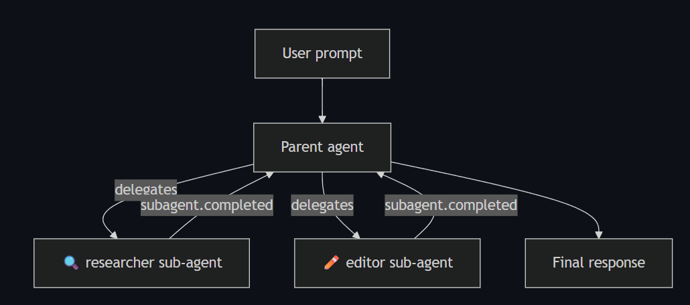

# Subagents

have its own system prompt, tool restrictions and MCP servers, runtime delegates to that agent,
and then subagent runs in its own isolated context, and streaming lifecycle back to the parent session.



```ts
import { CopilotClient } from "@github/copilot-sdk";

const client = new CopilotClient();
await client.start();

const session = await client.createSession({
    model: "gpt-5.4",
    customAgents: [
        {
            name: "researcher",
            displayName: "Research Agent",
            description: "Explores codebases and answers questions using read-only tools",
            tools: ["grep", "glob", "view"],
            prompt: "You are a research assistant. Analyze code and answer questions. Do not modify any files.",
        },
        {
            name: "editor",
            displayName: "Editor Agent",
            description: "Makes targeted code changes",
            tools: ["view", "edit", "bash"],
            prompt: "You are a code editor. Make minimal, surgical changes to files as requested.",
        },
    ],
    onPermissionRequest: async () => ({ kind: "approve-once" }),
});
```

you can define per-agent skills

you can pass `agent` in session config to pre-select which custom agent should be active when the session starts. The value
must match the `name` of one of the agents defined in `customAgents`

```ts
const session = await client.createSession({
    customAgents: [
        {
            name: "researcher",
            prompt: "You are a research assistant. Analyze code and answer questions.",
        },
        {
            name: "editor",
            prompt: "You are a code editor. Make minimal, surgical changes.",
        },
    ],
    agent: "researcher", // Pre-select the researcher agent
});
```

# Best practice

Keep agent descriptions specific.

Pair a researcher with an editor

Handle failures gracefully, always listen for `subafent.failed` events and handle then in your application

