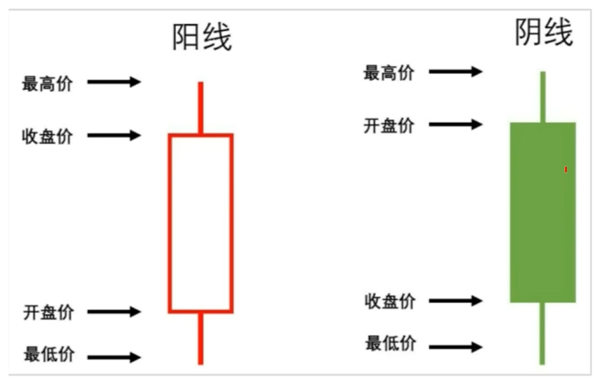
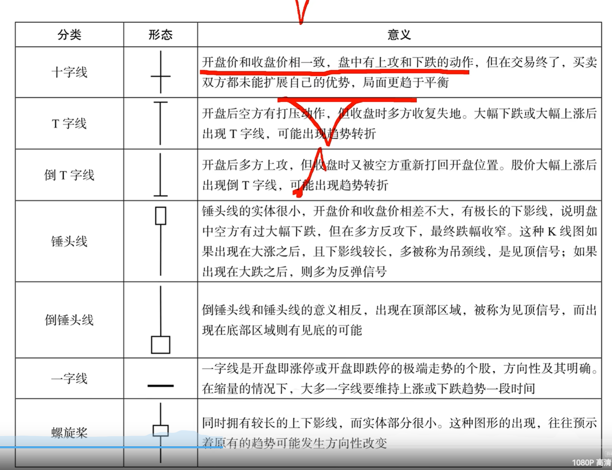

# basics

股票收益 = 资产升值 + 分红

沪市主板: 60开头
深圳: 00开头
创业板：深圳，300开头，两年交易经验，入金10万20个交易日
科创办：上交所，688开头 如今50万20个交易日
北交所 8开头，两年交易经验，入金50万20个交易日
港股通 入金50万放30天

9.15 - 9.25 集合竞价
9.15 - 9.20 可挂单可撤单

尾盘收盘集合竞价: 14:57 - 15:00
9:30 ~ 11:30, 13:00 ~ 15:00

交易顺序：价格优先，其次按时间

开通券商账户，绑定银行卡，钱转入券商托管银行

买入数量：1手=100股，卖出无股数限制

T+1买入，当前买第二天才能卖，资金提现还要再等一天
部分可转债可以当天买卖
部分跨境，黄金，etf可以当天买卖

涨跌幅限制，涨停，跌停 10% ，创业板和科创版20，北交所 30%

# 指数基金 ETF 规则

大盘 沪深300， 一版代表A股的基准利率
科创50，一半都属于创新型中小企业
宽基指数
行业指数
策略指数

ETF 场内基金 就是指数+基金
指数是一种选股规则，按照设定好的选股规则来买入一篮子股票，基金公司设立了1:1复刻指数用来交易

# 费用

手续费构成: 券商手续费，过户费、印花税、过户费
特惠账户能够省钱

# 数字

量比 > 1表示交易比较活跃，比过去五天活跃
换手率 = (成交量/流通股本) 乘以 100%
热门股换手率高的时候一定要小心，可能是机构已经在出货了，股价有暴跌的可能
市盈率等于 当前股价除以每股收益
估值百分位表示当前估值在历史上的百分位，取十年内的数据

# K线

收盘价 最高价 开盘价 最低价，四个位置可以看出当日股价的走势，比如一些极端情况，
收盘价和最高价齐平等等，可以自己取想象一下整日的股价走势
收盘价距离最高点叫上影线，收盘价距离最低点叫下影线

绿色是阴线，开盘价在上面

# 技术分析
通过研究历史市场数据，比如价格和成交量，来预测未来市场趋势的方法

无论是上影线还是下影线，本质是代表了分歧

均线: 移动平均线，是某个时间段内的收盘价的平均值的计算结果
如果股价整体处于上升趋势，当出现回调下跌，回落到某一均线时停止下跌，并延续之前的
上升趋势，意味着该均线对股价有支撑作用，通常被视为是一个买入点
反之，股价处于下跌趋势中，那么均线代表一个压力位

均线交叉，当短期均线下穿中长期均线形成死叉的时候，通常是卖出信号，说明最近五个交易日股价在下跌，空方
力量大于多方力量，处于空头市场，是一种卖出信号，相反，上穿叫做金叉，是一种买入信号

趋势，看低点和高点，是否不断抬高，上升三角形，下降三角形

# MACD
MACD 指数平滑异同移动平均线，用来确定趋势，买入和卖出信号的指标，是基于收盘时
股价或者指数的快变及慢变的移动平均值

DEA
DIFF

都处于0轴以上，属于多头市场，处于0轴一下，属于空头市场
DIFF自下而上穿越DEA，MACD金叉，买入信号
DIF线由上而下穿越DEA，形成MACD死叉，卖出信号

MACD是一个长期的指标

DIFF统计的是“短期趋势与长期趋势之间的距离和动能差异”。计算公式：通常为12日指数移动平均线（EMA）减去26日指数移动平均线。$$\text{DIFF} = \text{EMA}(12) - \text{EMA}(26)$$实际意义：DIFF线对价格变化非常敏感。当 DIFF > 0 时，说明短期均线在长期均线之上，市场整体处于多头（上涨）趋势。当 DIFF < 0 时，说明短期均线在长期均线之下，市场处于空头（下跌）趋势。DIFF线快速拉升，意味着短期内上涨动能正在急剧增强。

2. DEA 线 (差离平均值 / 慢线 / 信号线)DEA统计的是“DIFF线的历史平均水平”，用来作为判断DIFF走向的基准线。计算公式：通常为DIFF线的9日指数移动平均线。$$\text{DEA} = \text{EMA}(\text{DIFF}, 9)$$实际意义：DEA线是经过再次平滑处理的DIFF线，因此它的走势比DIFF线更平缓、更迟钝。它的主要作用是作为一条“信号线”。

# BOLL布林线