# 颐和路阴雨天街拍

## 拍照逻辑

一组照片，需要有各种景别，各种角度各种焦段

可以有远景，有特写，有俯拍仰拍有半身，组合起来成为一套图片，但是主要的点是
色调要统一，情绪要一致

## 拍照姿势参考

### 低角度仰拍，黄红绿撞色

### 俯拍

和环境互动而不是看人

活力动作： 弓步

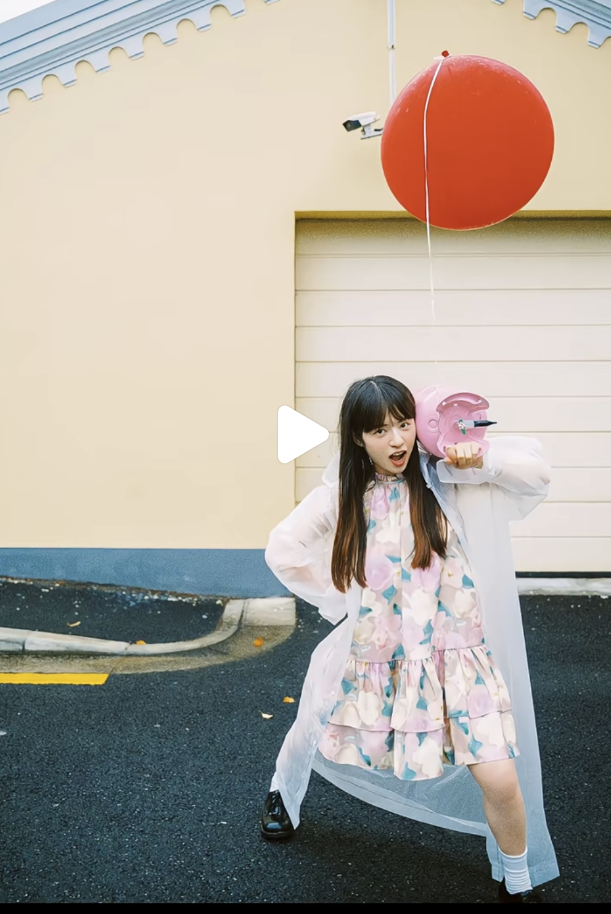

睡在伞上面，低角度

活力动作：跳跃

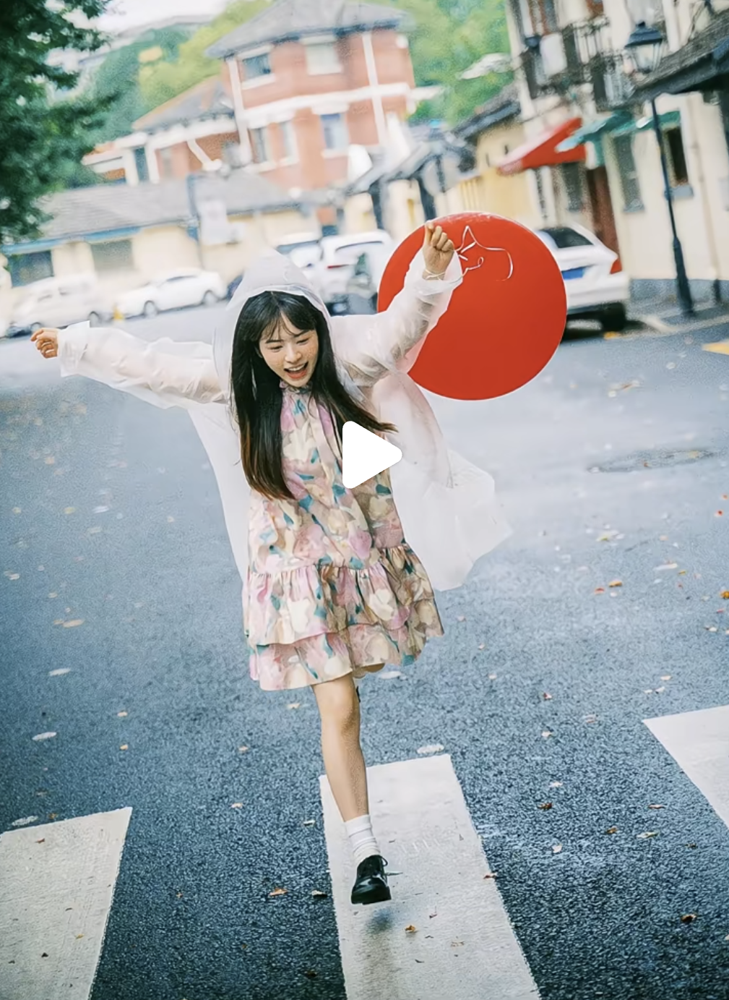

向前跑然后回头

转伞

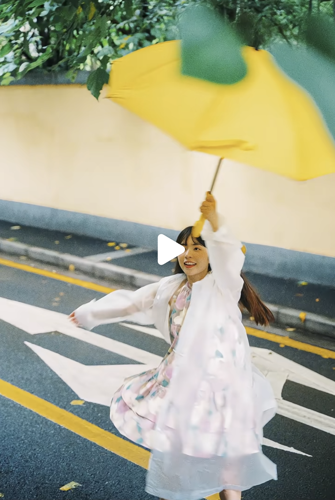

往后倒

纵深感向前跑

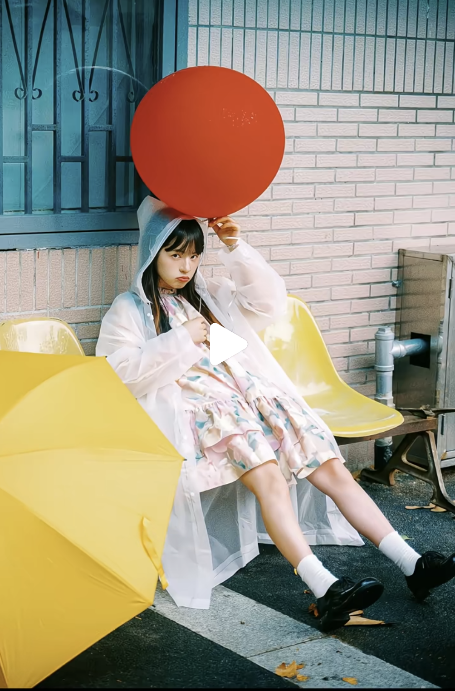

# 喵喵街

位置: owner coffee，喵喵街，买一杯咖啡作为道具

24mm 手伸直， 头倾斜 

拍侧面，人物居中就好

道具书挡着一点，脸露出来

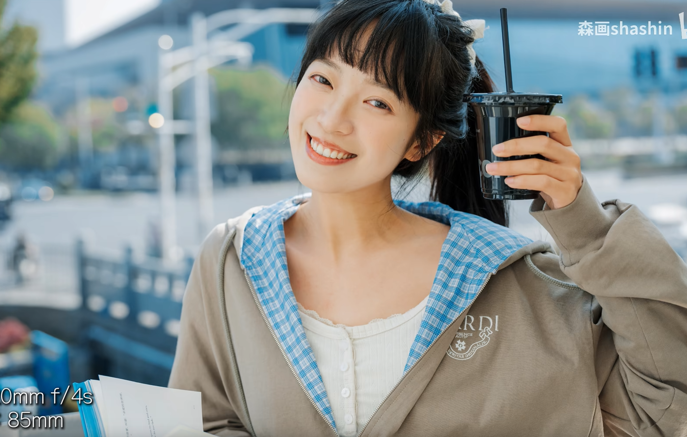

这种半身，可以用85焦段

前景，脸上找光线

有时候，不一定要看人，眼睛看向上面也可以

从门后面看过来

隔着玻璃，手伸出来作为前景

俯拍，楼梯上来，动感一些

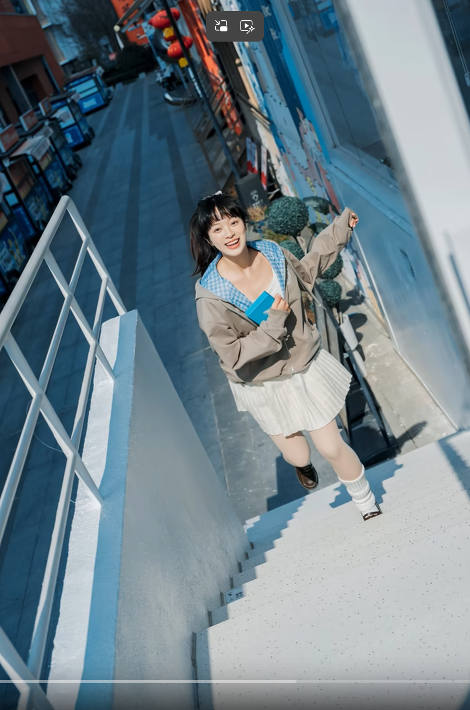

仰拍，栏杆边，结合环境

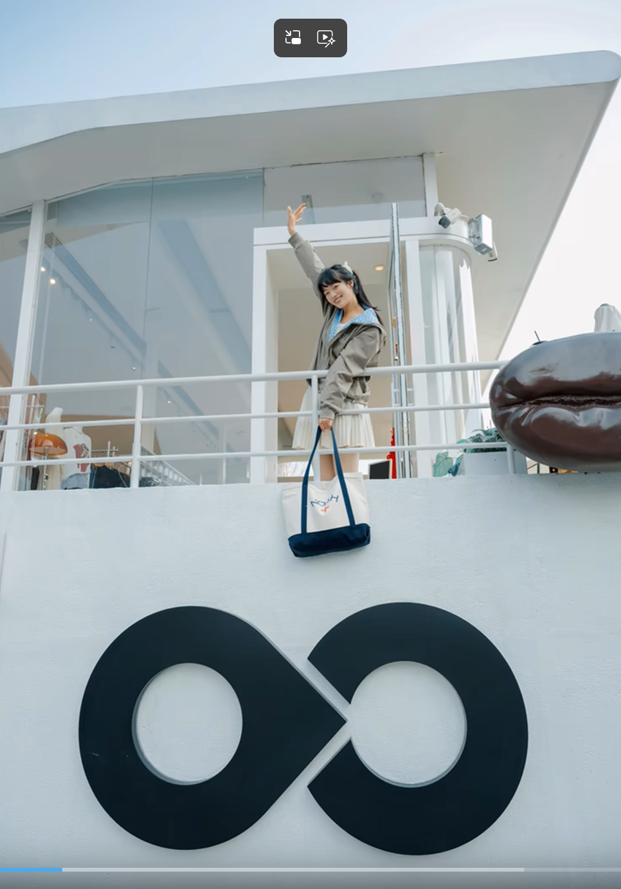

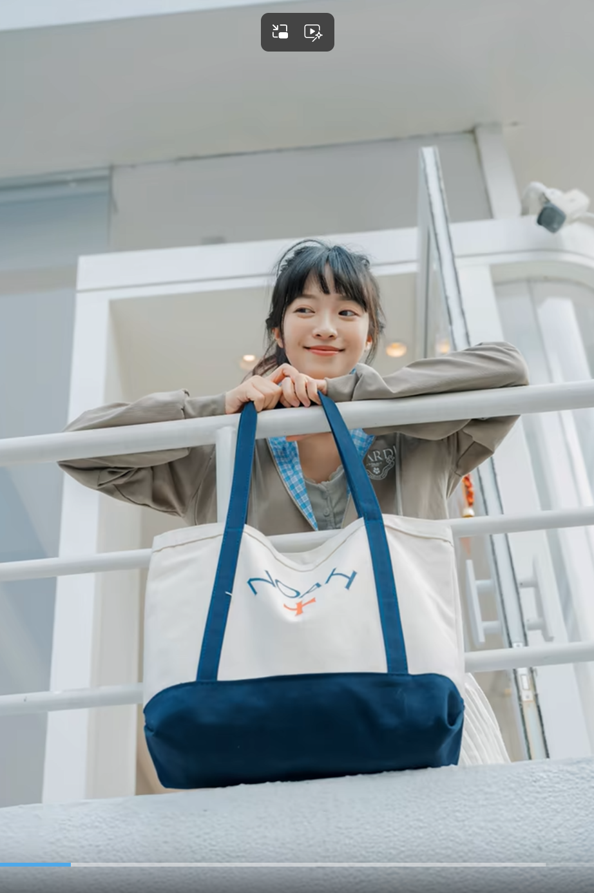

特写，眼睛可能在看别处，没关系，抓住情绪就好

咖啡举过头顶

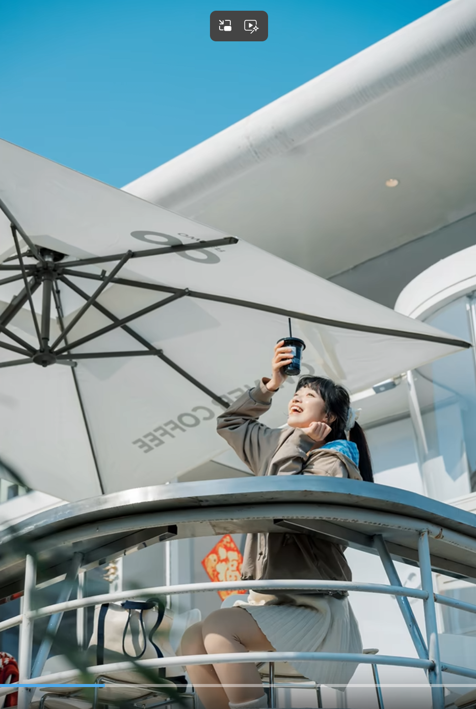

喝一口

举头后仰

手绷直，踢腿，可以看到后面保利大剧院作为了背景

对角线构图，贴在猫猫旁边

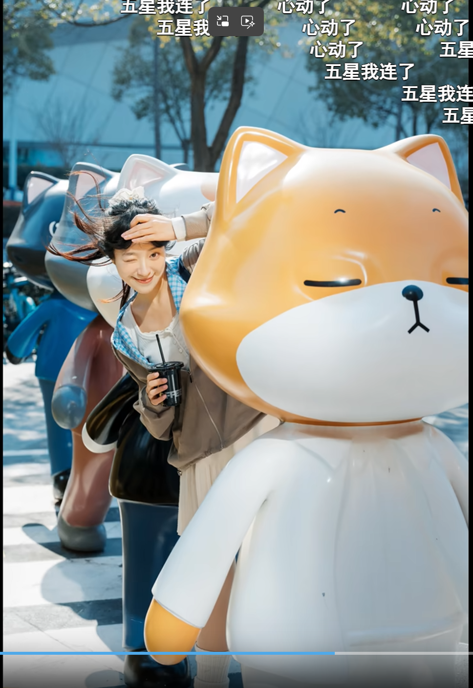

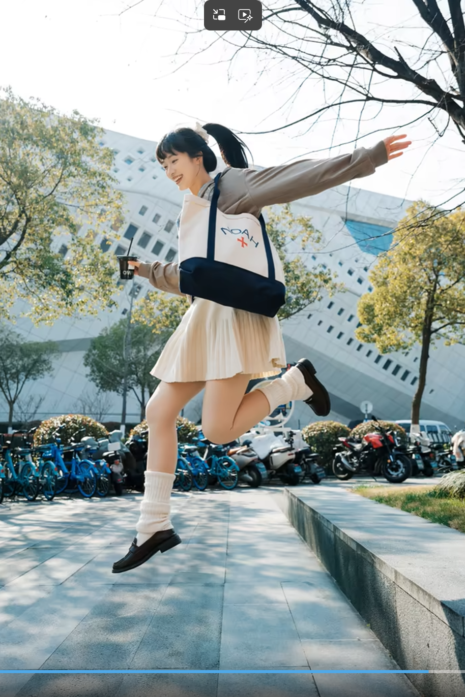

泼水做前景

电梯下来，有点前景

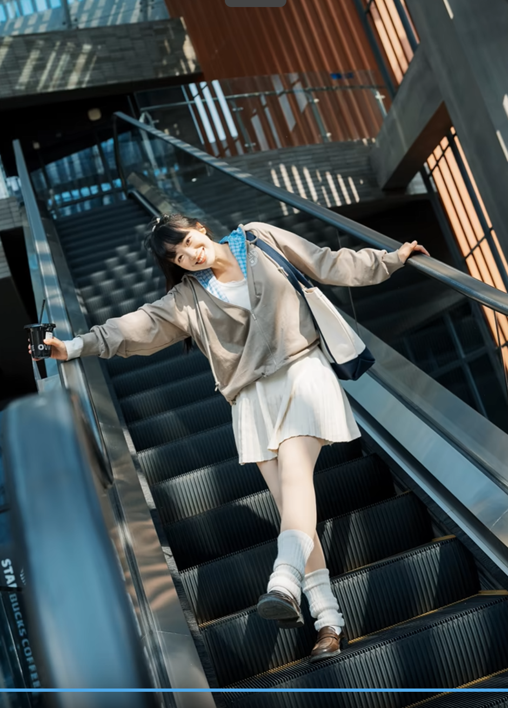

前景 + 情绪 + 光线

85拍大头，但是不一定是正脸

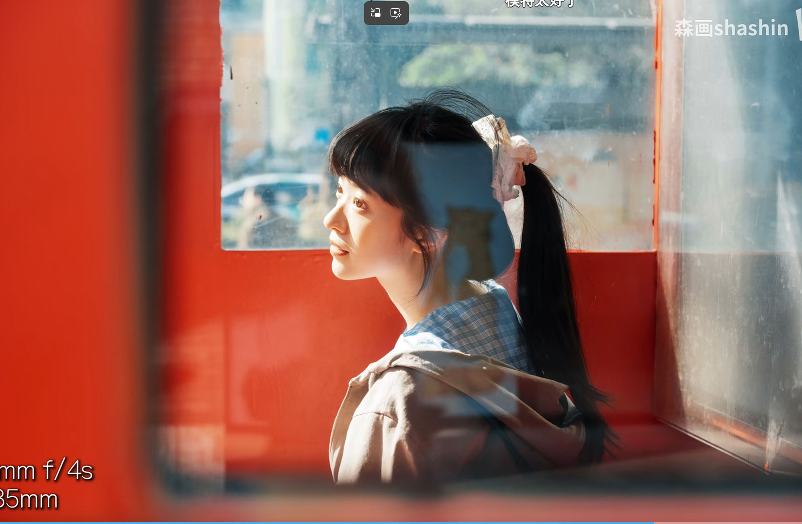

三分法，情绪风

感觉很用力地提箱子

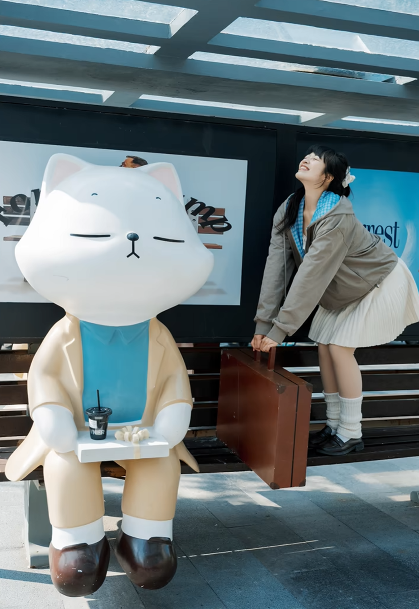

引导线

