# 长焦拍摄

退足够远，模特做符合环境的动作，就能足够好看

# 小广角比如35mm 

午饭饭教学：https://www.bilibili.com/video/BV1uF4m1w7U4/?spm_id_from=333.337.search-card.all.click&vd_source=87b022a867c7ad76d4070b3a820ca615
提问: https://www.bilibili.com/video/BV1Jt421E7Ky/?spm_id_from=333.788.recommend_more_video.0&trackid=web_related_0.router-related-2589621-4bxql.1784986787440.22&vd_source=87b022a867c7ad76d4070b3a820ca615

要有人在景中而不是人在景前的思维

## 记录活力，适合

1. 仰拍俯拍
2. 带一些前景
3. 半身人像, 九宫格，人物放在四个点和四条线之上

引导线在小广角下面有汇聚，比如有风的时候，窗子、护栏等从侧面斜着拍过去，不要正对着建筑去拍,
可以斜着45度拍摄

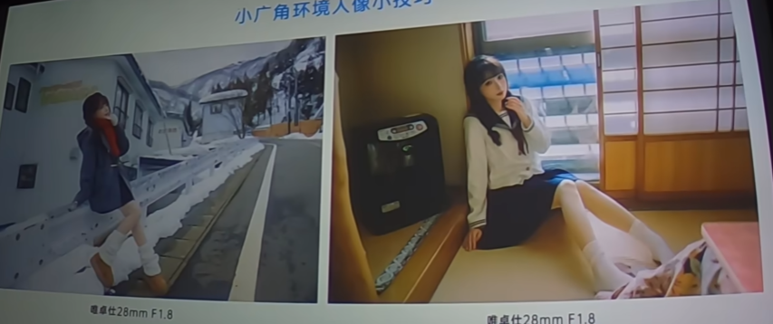

这样既可以拍出街边的景色，也可以拍纵深

相机举起来俯拍，让人物的头不要出现在天空这样的位置（容易过曝从而变黑）
给人物选一个更加暗的背景，来衬托人物

充分利用前景和延申感
拍纵深不仅仅可以是从左到右的延申，还可以是从上到下，从下到上的延申，人物的脸放在太过于靠上的位置容易变形，可以把人物放在画面居中的位置，
然后填充一些前景，这样人物就不会显得空了。比如这里的例子：楼梯从下往上和从上往下，落叶作为前景。阴天不要带上太多的天空，因为天空是死白的，
拍出来没有什么意思。光线不太好的时候，比如用路灯，可以抬头等方式，让顶光变成了侧光

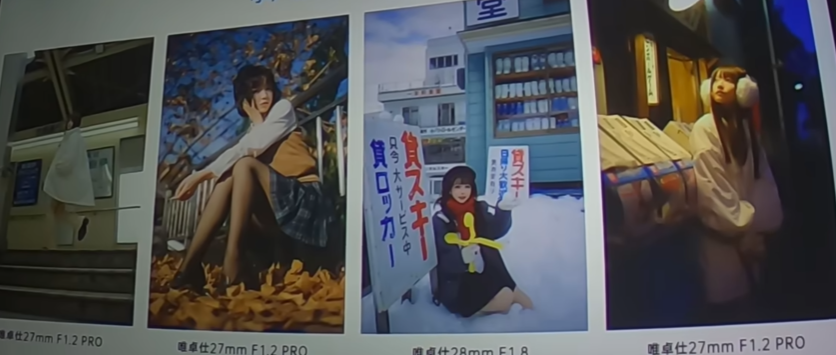

还可以利用肢体的透视

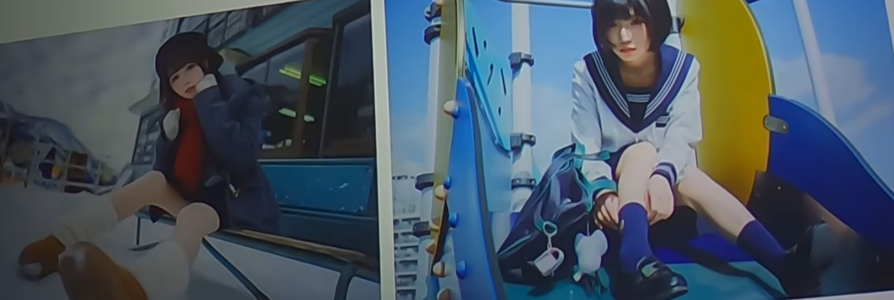
利用透视的时候，可以把脚切一下，这样不会显得脚很大，也能排除在环境中的感觉

拍小广角其实不用拍全身，可以拍半身，拍全身容易拍的满

不得不拍平面的时候，尽量横平竖直，用相机的高度来调整构图，尽量保持工整，有时候用85拍摄更加合适，
但是有时候没有条件

拍摄的时候可以与环境发生互动，表明人物是在环境中

1. 公园水池，拍水，绿植，包括比较好看的裙子等等，尽量逆光拍，这样可以拍出阳光把这些东西打透的感觉
2. 奶茶，咖啡
3. 耳机书本
4. 建筑门窗

拍摄背景是树的时候，可以稍微带上一点点天空，会有一点透气的感觉

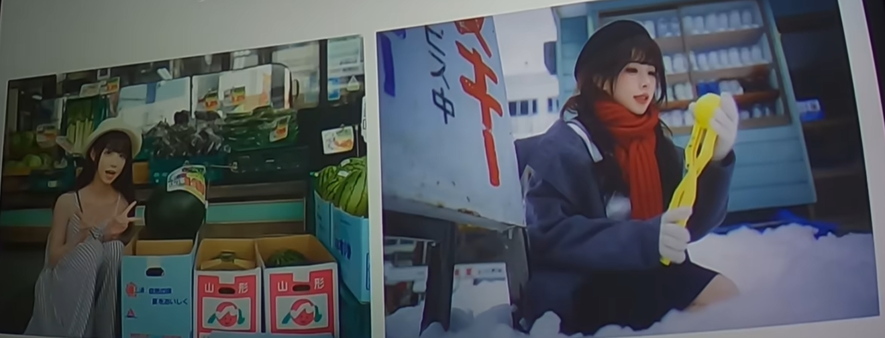

和猫猫狗狗互动，趴在窗子上找光（面光会比较好），人物的脸不要放在天空，逆光，放在阴影里，这样发丝光会很好看

还可以直接与镜头互动，仰拍，从上往下看过来，或者躲到桌子下面去

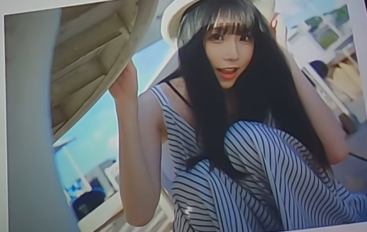

道具可以放很多个，比如这里有四个雪球，可以从近到远，体现出纵深感

小广角俯拍可以很容易拍到全身，显得很特别，这样会显得脸小，脸型好

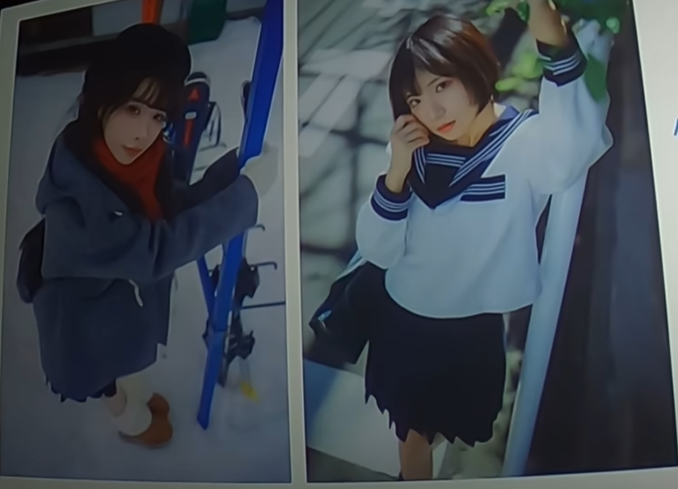

贴在地方往上面拍，比较有动感，也可以把腿拍的很长，拍跳跃，仰拍也会显得人跳的很高，让地平线比较低
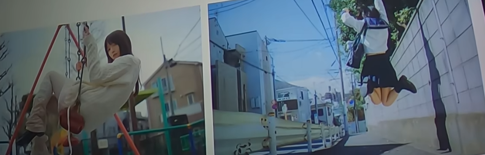

## 斜构图怎么拍:

斜构图的要义就是景斜人不斜，将视线集中到人物身上，一般仰拍或者俯拍的时候回去斜构图，画面是斜的，
人物可以调整让她不那么斜，倾斜的背景会让视觉感知比较弱，视线会更加集中在人物身上

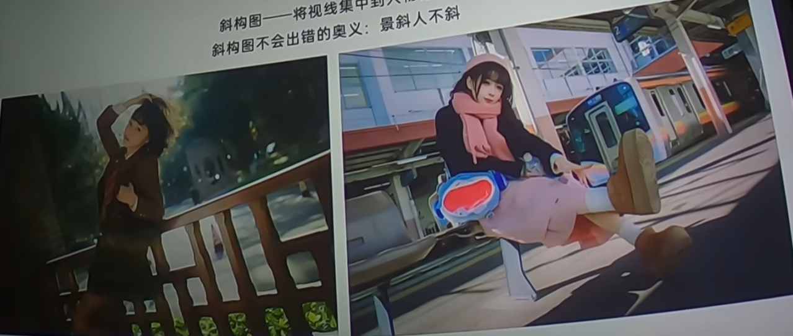
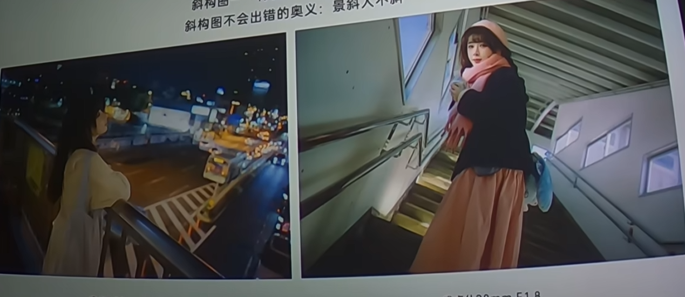

## 第三人称视角

体现电影感，非常适合用来做裁切，上下加个黑边，有电影感的处理，另外大光圈广角还
很适合夜景拍摄

## 组图

有特写有环境，有测光有逆光

# 视角

可以选择仰拍、俯拍等不同的视角，避免总是用水平视角去拍照，会比较死板
如果要用歪斜的构图， 请与仰视或者俯视的视角配合（核心在于，让人物是正对屏幕的），这样就不会显得乱

# 构图

## 三分法构图

人物在三分线上，但是不用强求一定是眼睛在交点

比如高机位从上往下拍摄，可以把人物放在下方的参考线，这样上方可以留尽量多的空间展示环境景色

安排人和天空互动，可以把人放在下方三分之一位置

## 对称构图

比如有镜子的时候可以对称构图

## 对角线构图

常用于人躺着坐着的高机位拍摄

可以避免左右构图的呆板

## 引导线构图
通道、栏杆等突出主体，可以把人物放在灭点（交汇点）的反方向，这样更加有张力，
比如有楼梯或者栏杆的时候，可以把相机贴近栏杆，这样就会有线条的延伸感

## 框架构图

借用门框，窗框，花朵等等，把人物框定在里面，重点还是突出人物

## 中心构图
比较稳重，不容易出错，可以用在抓拍一些动态动作，以及抓人物的情绪的过程中,
比如特写等等，可以用中心构图把人物放在中心

# 动作引导

## 样图收集

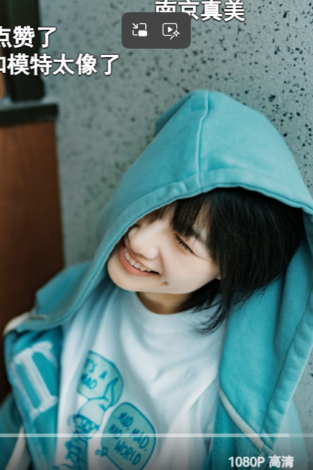
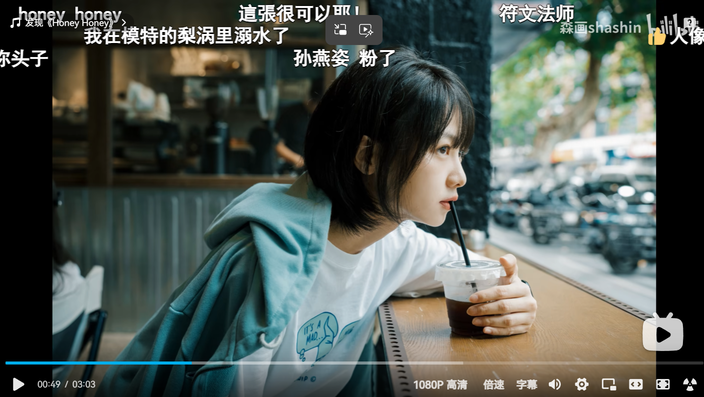

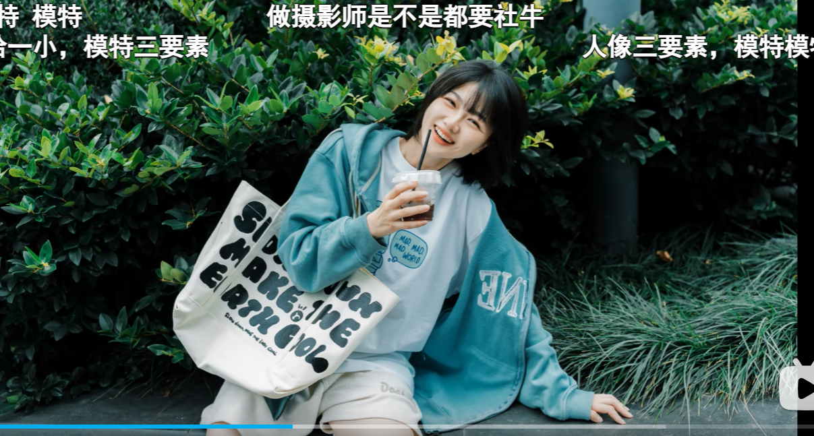
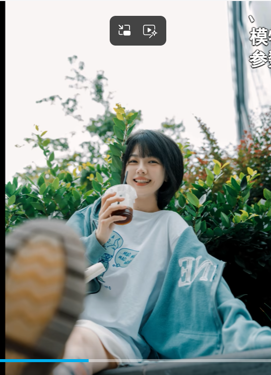
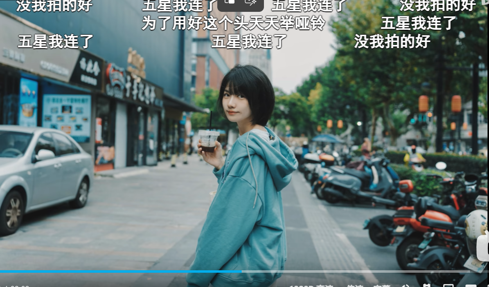

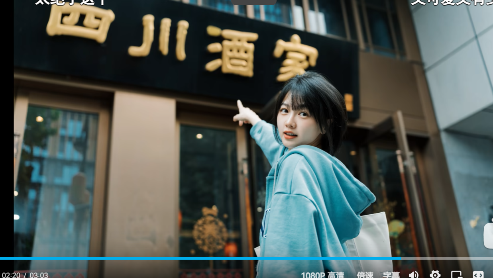

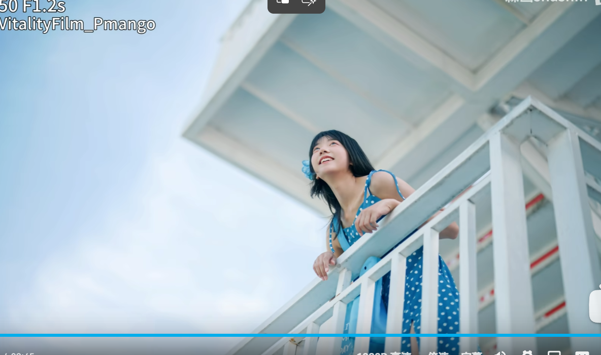

# 后期

注意光线，脸在树旁边，在红砖墙旁边，就是会发绿发红，所以前期要足够地精细
调色，从一个摄影师去开始模仿，就模仿这个摄影师地风格

阴天尽量拍一些脸朝上的画面，能接一些天光，同时少带一些天空，避免出现死白, 阴天
尽量不要去拍大景色

摆姿势，描述一个场景，让模特自己去摆，然后微调，尤其是拍摄长焦的时候一定要调整构图

逆光拍摄，尽量让人物的面前是空旷的，这样拉亮之后是好看的，最好是一堵墙可以反光，不要是有颜色的比如树或者红色的砖瓦，
这样即使你拉亮之后它还是一个有颜色的脸色，这样是不好看的

派动态：跳跃，可以单脚跳，放低机位，转圈可以从两个方向去转, 还没开始摆好，就开始拍，可能比摆好之后更好看
一个场景里，大景，半身，特写，但是不要摆好动作一直拍