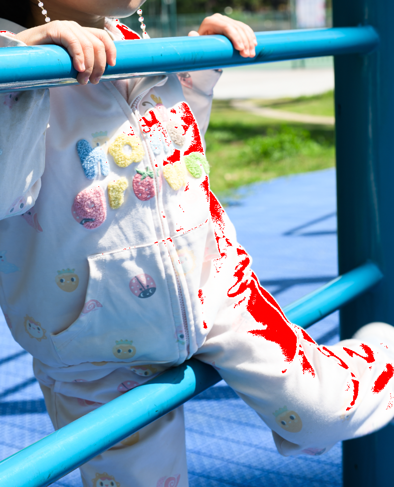
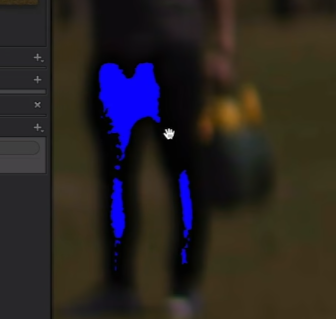
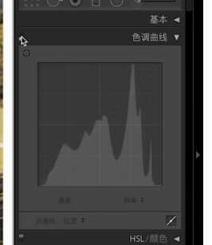
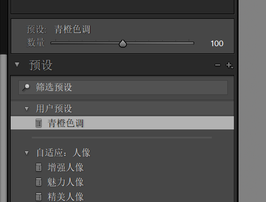

# 导入图库
# 可以给照片打星，然后右下角有过滤器可以过滤照片

# 修改照片, 进行照片的修改

*  历史记录，点击可以回到前面某一步
*  白平衡调整，可以用吸色工具去吸画面中的白色部分，然后就会自动调整
* 调整曝光，红色的点表示过曝的地方，可以通过拉曝光让红色的点小时（右上角过曝警告）
这个时候可以拉低曝光让这些红色区域消失，同样道理，如果有死黑，那画面中就会出现蓝色的区域 
* 如果是正午这些时候，可能对比度过高，可以把对比度拉回来一些，让直方图尽量集中在中间位置
* 色调曲线： 三个点，S型，调整对比度，高光拉一点下来 
* 校准， 以青橙色调为例，右右左，如果饱和度太高，可以把饱和度拉下来一些
    红色52
    蓝色 -53
    绿色 右边一点

* 应用调整到其他照片, 左侧新建预设，然后可以在其他照片的地方选择使用这个预设 
* 裁切，选择 16:9 然后按键盘上的x键，就可以把图片的裁切变成 9:16
* shift + Y 可以看调整前后的对比

## 校准工具

色相，色相增加或者减少，会被它相邻的颜色所取代，增加，则被顺时针方向的颜色取代，减少，则被逆时针方向的颜色取代，并且它的互补颜色的范围变大，
比如，绿色色相增加，那么会接近青绿色，并且反方向的黄色的饱和度会降低

常见的网红色调

* 青橙: 红向右，蓝向左，绿色都可以，向右向左分别对应暖色占比和冷色占比的不同
* 黑金，在青橙基础上，将冷色调的饱和度降低（让他们接近黑白）就变成了黑金的色调
* 蓝黄色调：红色向右，绿色向左，这样画面中大块面积都是黄色和橙色，同时降低一些对比度