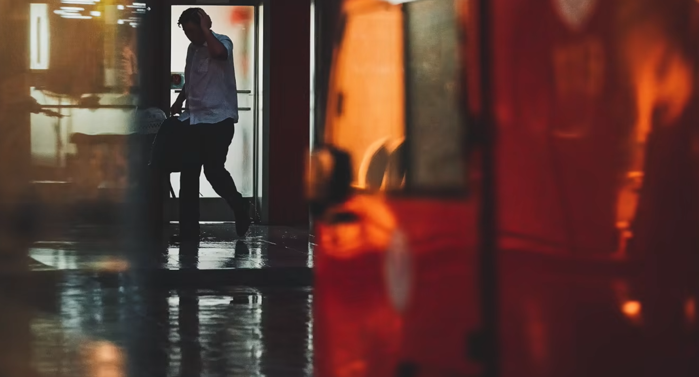
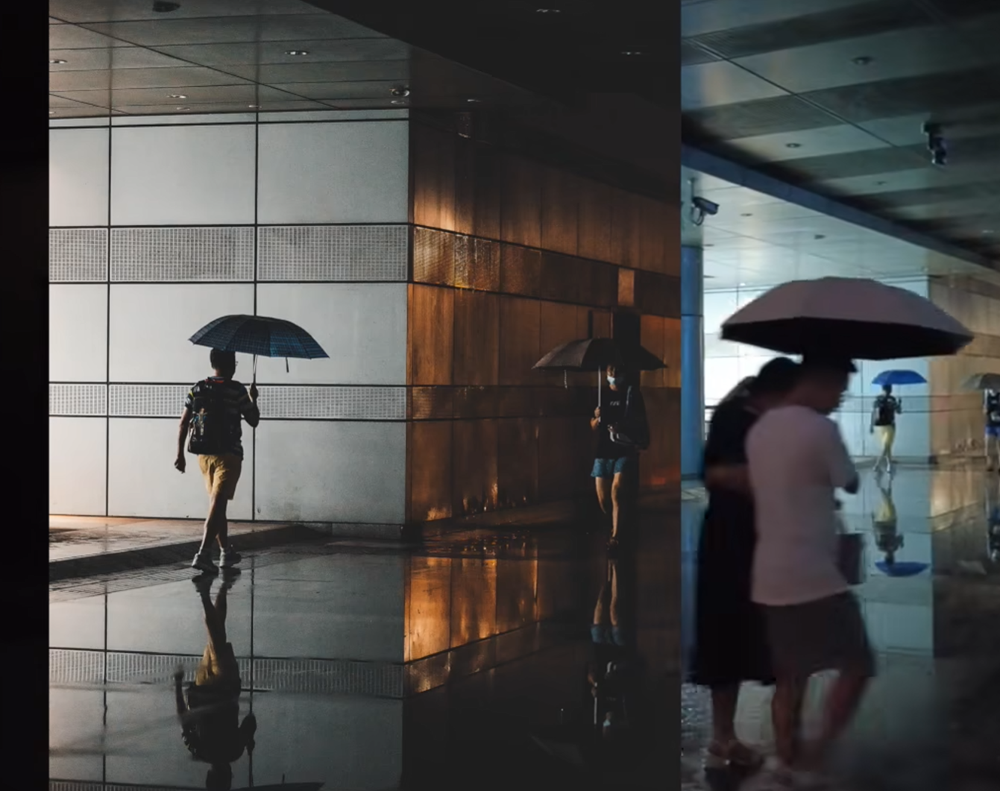
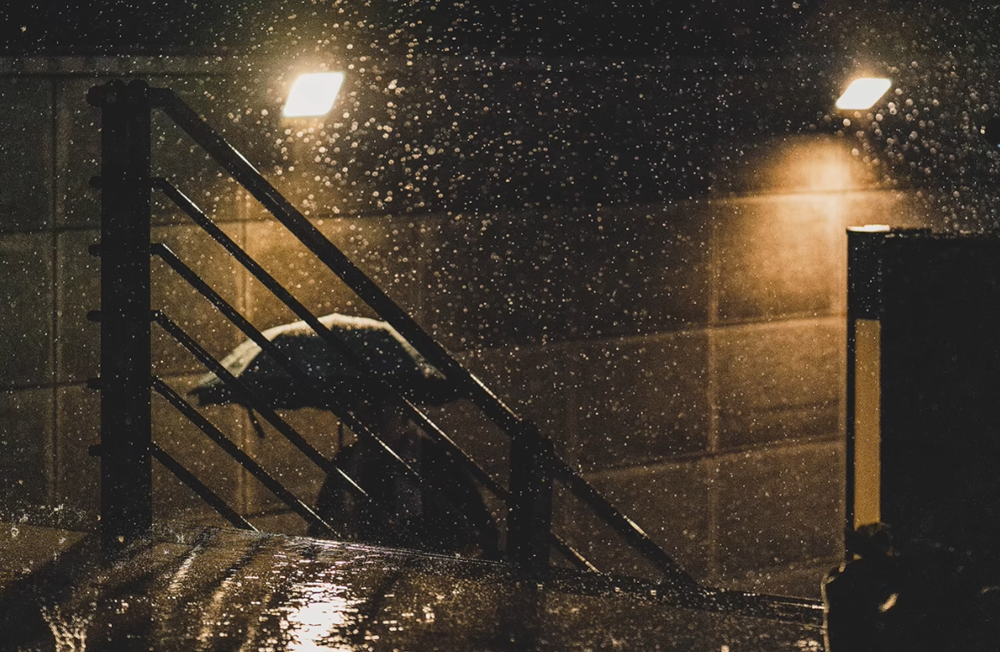
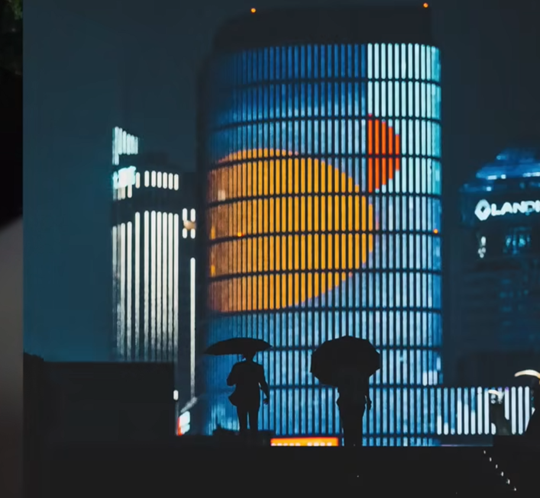
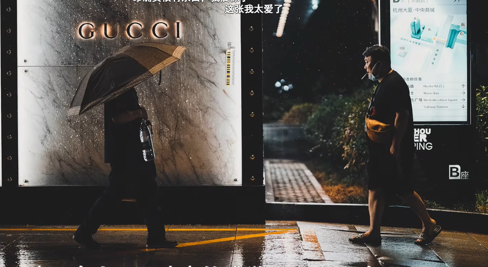

# 街拍整理

## 概览

这份文档整理自现有街拍笔记，内容聚焦两个部分：

- 可尝试的街拍地点
- 晴天与夜晚的街拍思路、构图方式与现场观察重点

原始素材：

- `raw/街头摄影/拍摄地点.md`
- `raw/街头摄影/郭城安/街拍/街拍1.md`

## 拍摄地点建议

### 上海

- 徐汇滨江公园
- 龙美术馆

### 南京

- 待补充

### 苏州

- 待补充

## 街拍核心思路

- 街拍更强调“环境中的人”，而不是单独拍成强肖像感的照片。
- 先观察光，再决定机位、前景和等待对象。
- 与其追着人拍，不如先找到合适的光位和构图，再等人物走进画面。
- 逆光有利于拉开人物和背景的层次，也更容易形成剪影。
- 前景、边框、镜面、立柱、楼梯、玻璃反射都可以成为画面的组织工具。

## 晴天街拍

### 曝光与景深

- 晴天不必把光圈开得太大。
- 可以使用类似 F5.6 的设置，让画面保留一定环境信息，同时让主体与背景产生适度分离。

### 常见拍法

1. 逆光结合框架构图，拍出剪影和明确的明暗对比。
2. 顺光时利用被照亮的建筑色彩，再加入芦苇、花等前景。
3. 把柱子、栏杆等线条当作构图元素，等待人物进入画面。
4. 寻找有纵深感的街道、走廊、通道，让人物处在透视线中。
5. 使用“黑包白”思路，让深色区域包裹亮部主体，形成视觉聚焦。
6. 利用镜子或反射面制造画面层次与陌生感。
7. 在地下车库等位置从低处向上拍，适合中心构图和高反差画面。
8. 用树叶等自然元素做前景，让阳光和人物剪影一起进入画面。

### 晴天关键词

- 剪影
- 框架构图
- 黑包白
- 线条
- 前景遮挡
- 纵深感
- 镜面反射

## 夜晚街拍

### 核心观察点

- 夜晚同样可以沿用“黑包白”的思路，把亮部当作视觉中心。
- 主动找光源，例如店铺、窗户、楼道、广告牌、路灯、车灯。
- 优先拍逆光和侧逆光，让人物从背景里跳出来。
- 雨夜、玻璃、水面、车窗都能增强光线层次。

### 常见拍法

1. 从室内向外透出的光源适合做画面中心。
2. 很暗的环境中，红色、暖色招牌和服装往往更显眼。
3. 雨夜车窗后的人影和倒影是很好的叙事元素。
4. 先找到灯光，再等待人物走进光区。
5. 暖光适合拍温馨场景，例如家庭同行、亲子互动。
6. 冷暖对比的双侧光适合等待两个方向的人同时进入。
7. 楼梯、墙边、建筑边缘都可以做分界线或剪影背景。
8. 玻璃反射、灯光反射和低角度广角建筑画面都适合夜景氛围。

### 夜晚关键词

- 主动找光
- 逆光
- 冷暖对比
- 玻璃反射
- 低角度
- 分界线
- 剪影层次

## 现场拍摄流程

### 1. 先看环境

- 先判断主光源位置。
- 再判断背景是否干净，是否有线条、框架、前景可用。

### 2. 再定机位

- 低角度适合夸张空间关系。
- 正面等待适合中心构图。
- 侧面等待适合利用墙面、楼梯、玻璃和柱子。

### 3. 最后等人物

- 等人物进入亮部。
- 等人物走到透视中心或边界位置。
- 等动作、姿态、人与人的关系形成画面张力。

## 避免的问题

- 只拍到人，没有拍到环境关系。
- 光线虽强，但人物和背景没有层次分离。
- 前景、反射、线条过多，导致主体不明确。
- 过度靠近人物，画面变成单纯肖像，不像街拍。

## 夜拍示例图

以下示例图来自原始笔记中已经明确引用的夜拍图片素材：

## 参考链接

- 视频：<https://www.bilibili.com/video/BV1Bj411T7te/?spm_id_from=333.1387.collection.video_card.click>