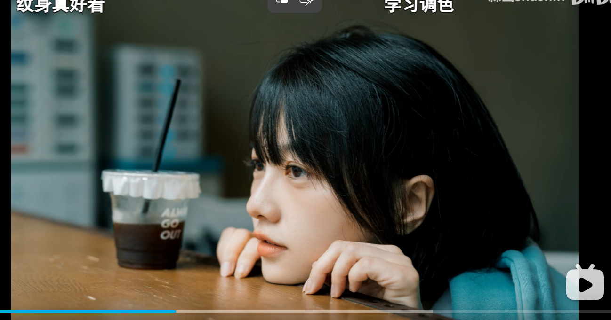
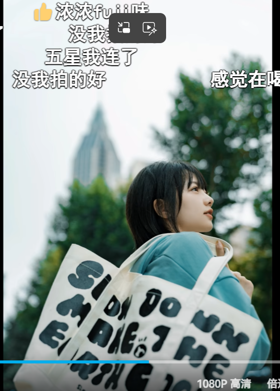
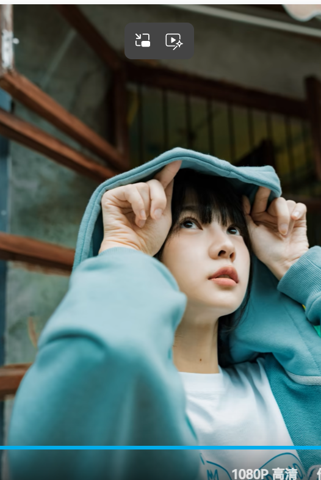

# 动作引导

## 动态动作

- **跳跃**：可以单脚跳，放低机位；仰拍会显得跳得更高
- **转圈**：可以从两个方向去转
- **抓拍时机**：还没摆好就开始拍，可能比摆好之后更好看
- 一个场景里覆盖大景、半身、特写，但**不要摆好动作一直拍**

> 摆姿势的方法：描述一个场景，让模特自己去摆，然后微调。拍长焦时尤其要调整构图。

## 姿势样图收集

## 相关页面

- [[南京街拍示例]] — 逐张机位与姿势示例
- [[视角与构图]]
- [[拍摄核心思路]]
- [[_Index]]
