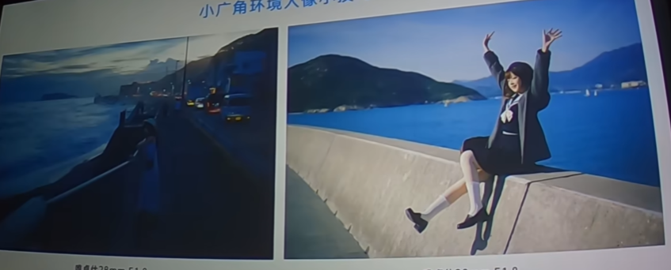
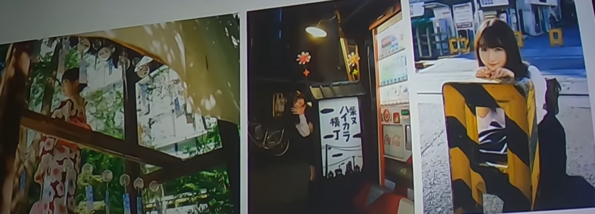
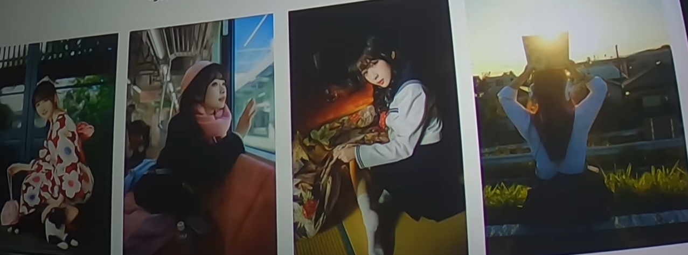
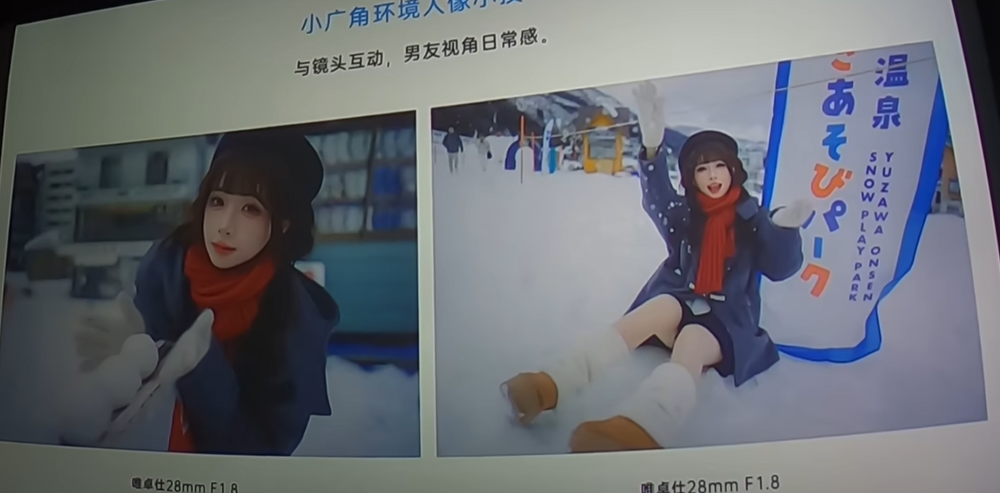
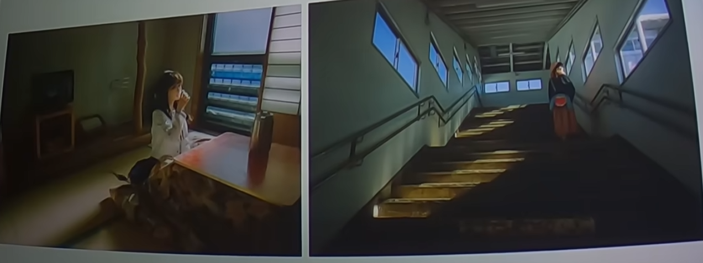

# 焦段运用

## 长焦拍摄

退到**足够远**的距离，让模特做符合环境的动作，就能拍得足够好看。长焦压缩空间、虚化背景，适合抓情绪特写。

> 拍长焦时一定要**调整构图**：描述一个场景让模特自己摆，再做微调。

## 小广角（35mm 左右）

核心理念仍是「**人在景中而不是人在景前**」。小广角适合记录活力，要点：

1. 仰拍、俯拍，避免水平死板
2. 带一些前景
3. 半身人像，配合九宫格，把人物放在四个交点或四条线上

### 引导线与斜拍

小广角下引导线会**汇聚**。有窗子、护栏等线条时，从侧面斜着拍过去，不要正对建筑，可以斜 45 度拍摄，既能拍出街边景色，又能拍出纵深。

### 俯拍避免头顶天空

相机举起来俯拍时，让人物的头**不要出现在天空位置**（容易过曝变黑）。给人物选一个更暗的背景来衬托。

### 充分利用前景与延伸感

纵深不仅是从左到右的延伸，也可以是从上到下、从下到上的延伸。人物的脸放太靠上容易变形，可把人物放在画面居中，再用前景填充，人物就不会显得空。

- 例：楼梯从下往上 / 从上往下，落叶作为前景
- 阴天不要带太多天空（死白无意义）
- 光线不好时用路灯，可让模特抬头，把顶光变成侧光

### 肢体透视

可以利用肢体的透视增强张力。利用透视时可把脚**切一下**，避免脚显得很大，也更有融入环境的感觉。

拍小广角不必拍全身，可以拍半身——拍全身容易「拍得满」。不得不拍平面时尽量**横平竖直**，用相机高度调整构图；有条件时用 85mm 更合适。

### 与环境互动

拍摄时与环境互动，表明人物身处环境中：

1. 公园水池：拍水、绿植、好看的裙子，尽量逆光，把这些东西打透
2. 奶茶、咖啡
3. 耳机、书本
4. 建筑门窗

背景是树时，可稍微带一点点天空，会有透气感。

和猫猫狗狗互动，趴窗子上找光（面光更好），脸放在阴影里而非天空，逆光时发丝光会很好看。

也可直接与镜头互动：仰拍、从上往下看过来，或躲到桌子下面。

道具可以放多个，例如四个雪球从近到远，体现纵深感。

小广角俯拍很容易拍到全身且显得特别，会显脸小、脸型好。

贴在地面往上拍比较有动感，也能把腿拍长；拍跳跃时仰拍会显得人跳得更高，让地平线更低。

## 斜构图怎么拍

斜构图的要义是**景斜人不斜**：把视线集中到人物身上。一般在仰拍或俯拍时用斜构图——画面是斜的，但调整人物让她不那么斜。倾斜的背景使视觉感知变弱，视线更集中在人物身上。

## 第三人称视角

体现电影感，非常适合裁切——上下加黑边做电影感处理。大光圈广角也很适合夜景拍摄。

## 相关页面

- [[拍摄核心思路]]
- [[视角与构图]]
- [[后期调色]]
- [[_Index]]
