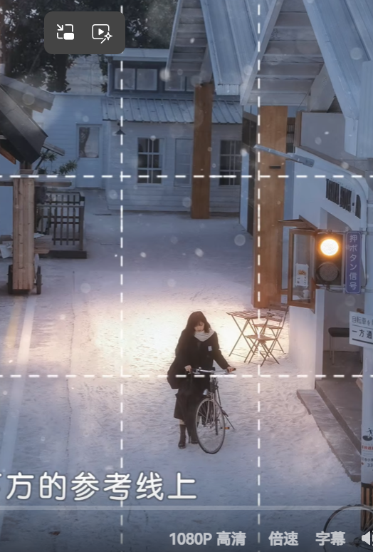
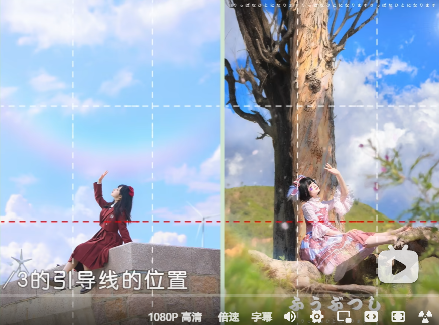
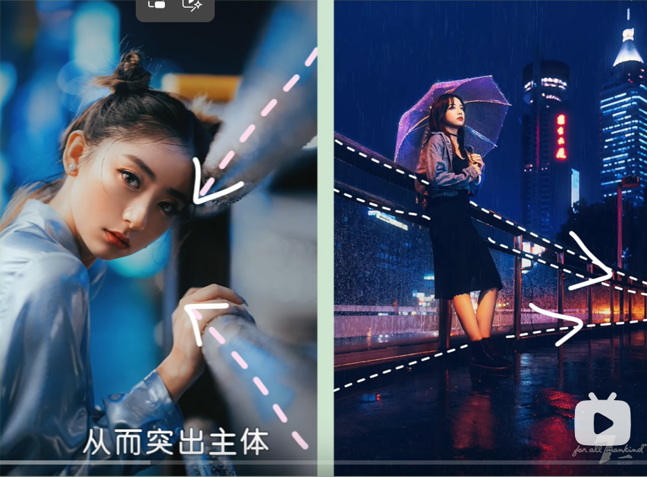

# 视角与构图

## 视角

可以选择仰拍、俯拍等不同视角，避免总用水平视角拍照——那样比较死板。

> 如果要用歪斜的构图，请与**仰视或俯视**配合（核心在于让人物正对屏幕），这样就不会显得乱。

## 构图法

### 三分法构图

人物放在三分线上，但不用强求眼睛一定在交点。

高机位从上往下拍时，可把人物放在下方参考线，上方留尽量多的空间展示环境。

安排人与天空互动时，可把人放在下方三分之一位置。

### 对称构图

有镜子等对称元素时，可以用对称构图。

### 对角线构图

常用于人躺着、坐着的高机位拍摄，可以避免左右构图的呆板。

### 引导线构图

通道、栏杆等可以突出主体。可把人物放在灭点（交汇点）的**反方向**，这样更有张力。有楼梯或栏杆时，把相机贴近栏杆，就会有线条的延伸感。

### 框架构图

借用门框、窗框、花朵等把人物框定在里面，重点仍是突出人物。

### 中心构图

比较稳重、不易出错，适合抓拍动态动作与人物情绪，例如特写时把人物放在中心。

## 相关页面

- [[焦段运用]]
- [[动作引导]]
- [[拍摄核心思路]]
- [[_Index]]
