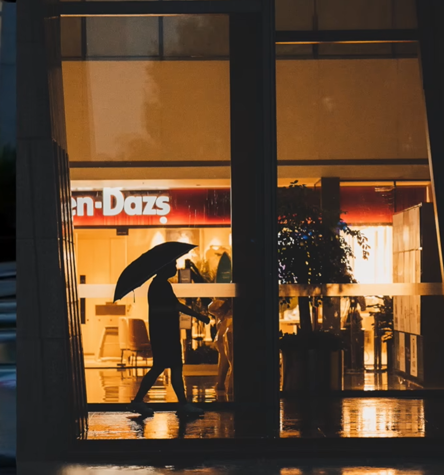
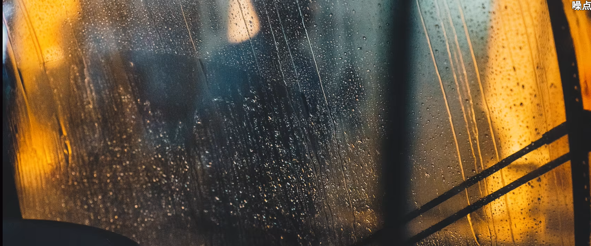
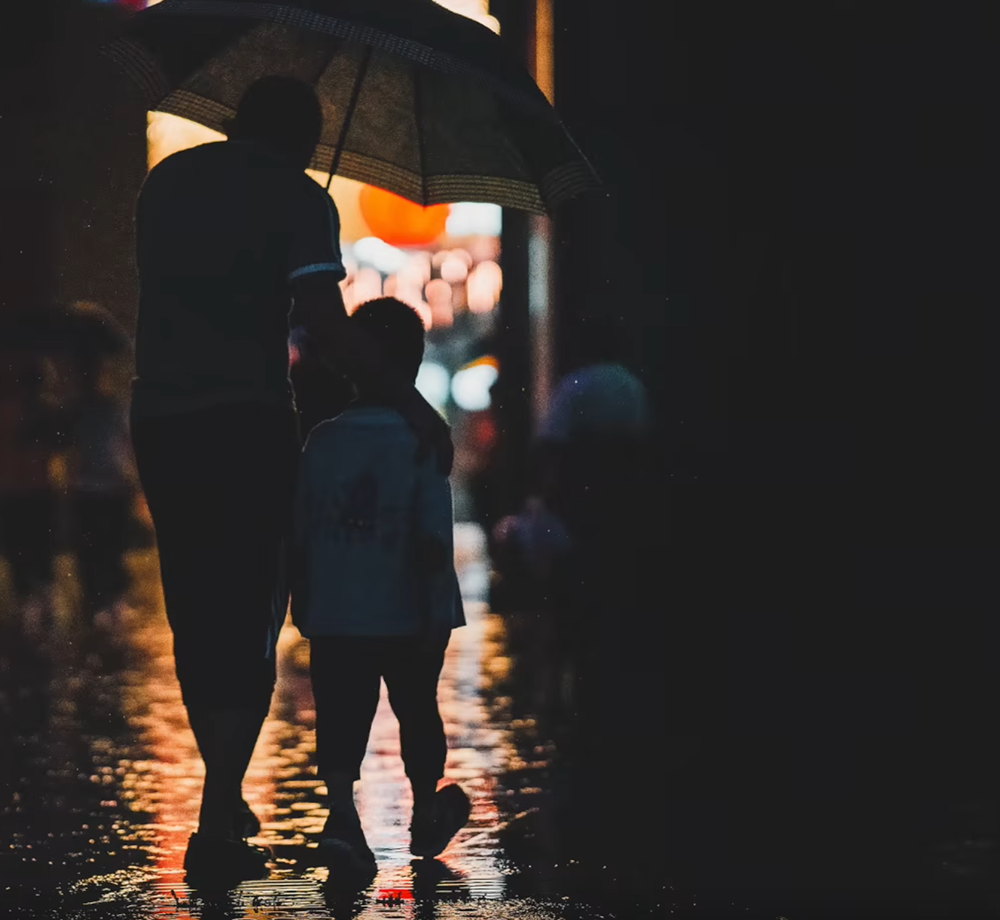
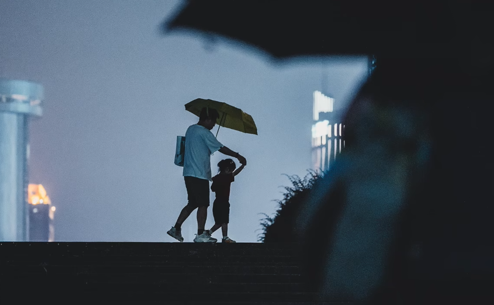
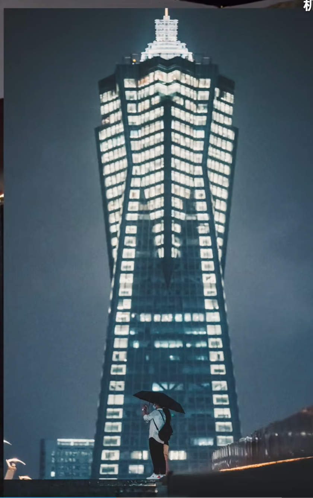
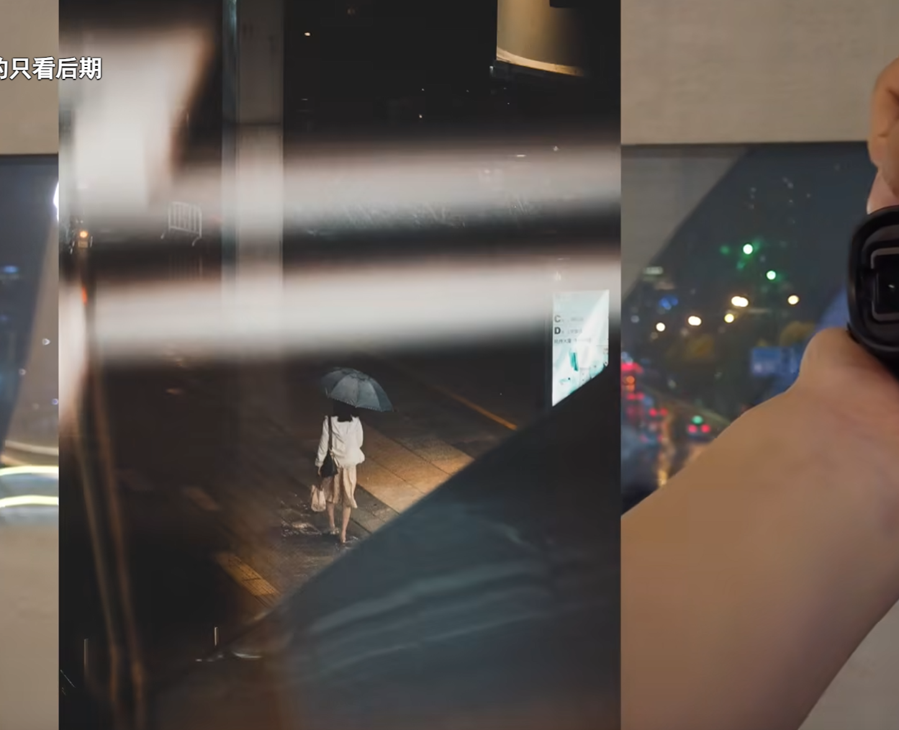

# 夜拍示例图集

以下示例图来自郭城安街拍笔记中的夜拍素材。

## 示例

### 示例 1：亮部作为视觉中心

### 示例 2：暗环境中的高饱和色彩

### 示例 3：雨夜、车窗与人物关系

### 示例 4：主动找光，等待人物进入

### 示例 5：暖光适合温馨场景

### 示例 6：环境中的人，避免强肖像感

### 示例 7：楼梯和建筑光源形成剪影

### 示例 8：前景遮挡增加层次

### 示例 9：低角度拍建筑与空间

### 示例 10：玻璃与灯光反射作为前景

### 示例 11：墙边与边界线组织画面

## 图片来源

原始图片位于 `raw/街头摄影/郭城安/街拍/` 目录，已复制到 `attachments/` 中。

## 相关页面

- [[夜晚街拍]]
- [[街拍核心思路]]
